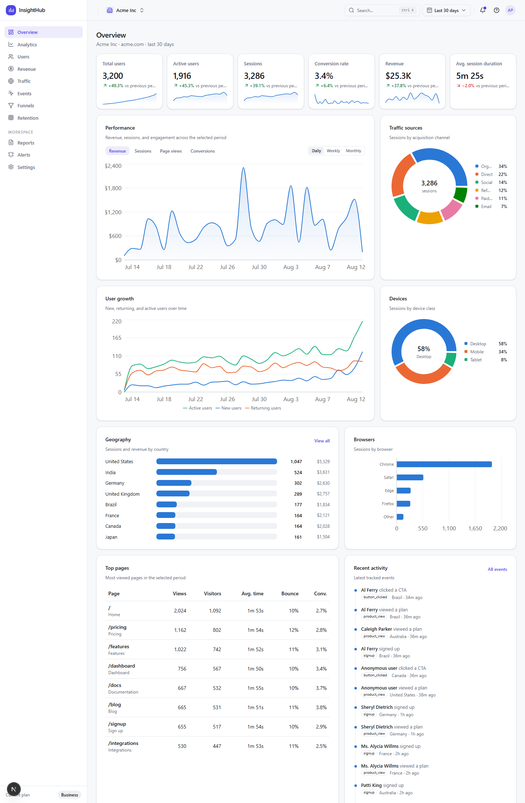
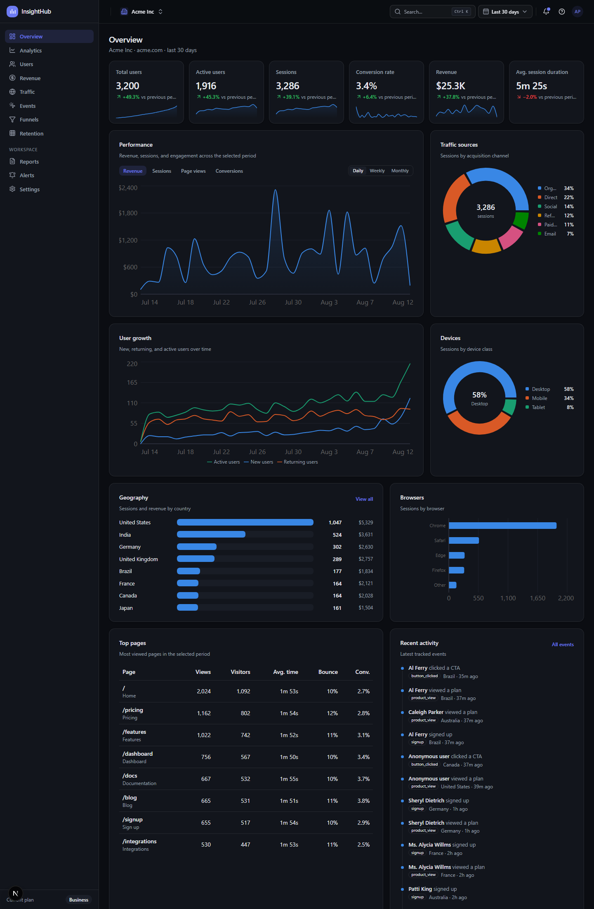
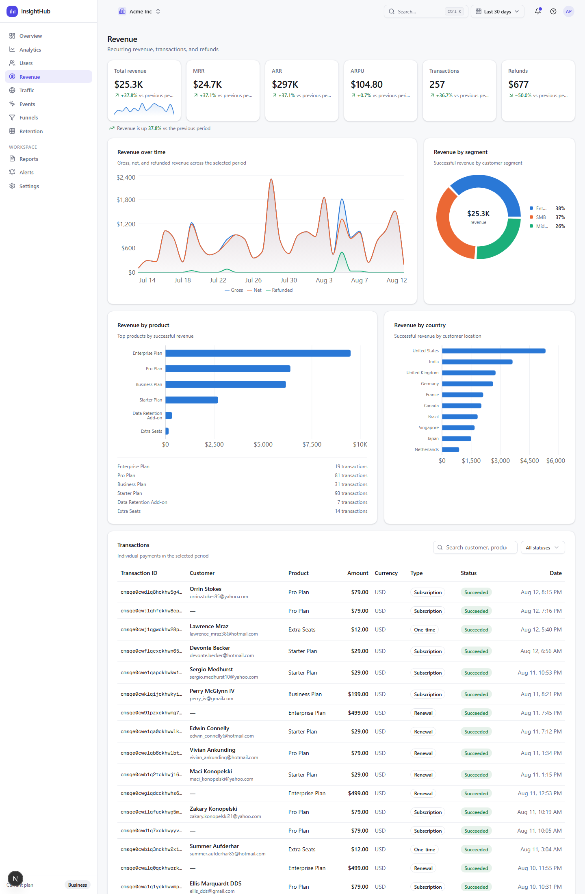
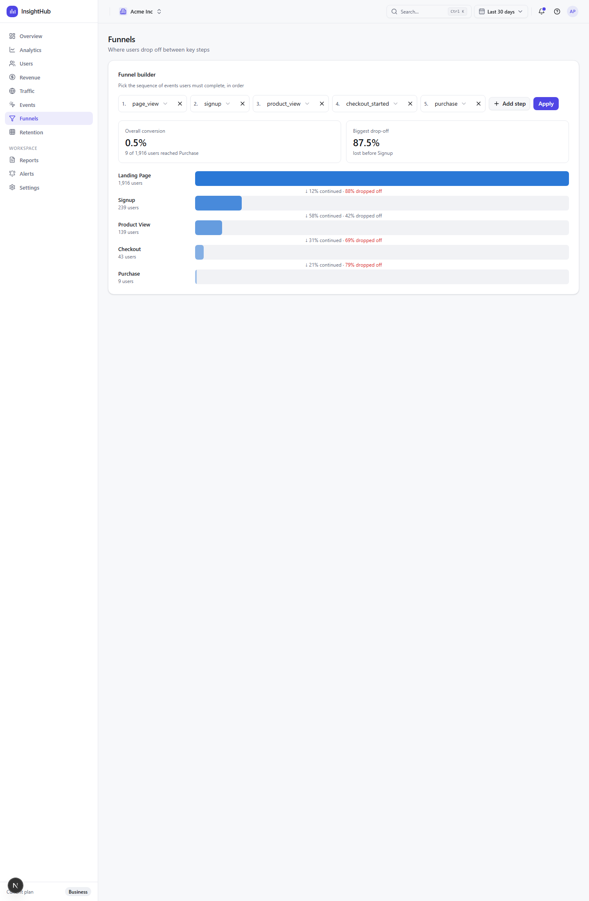
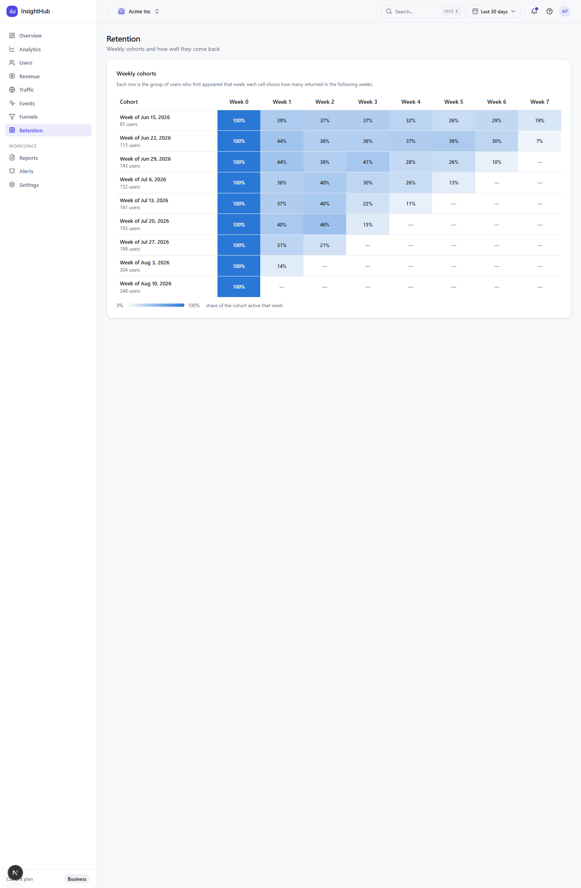
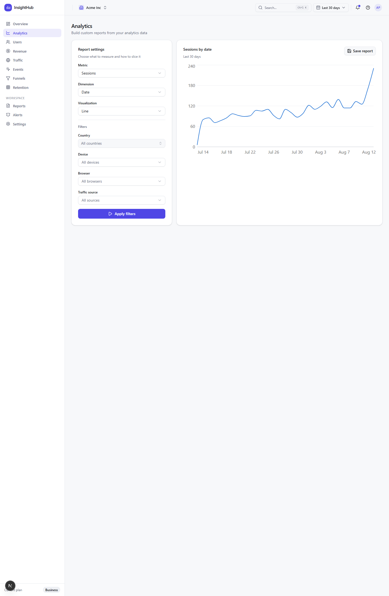
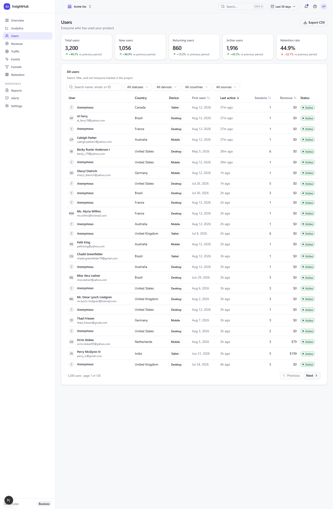
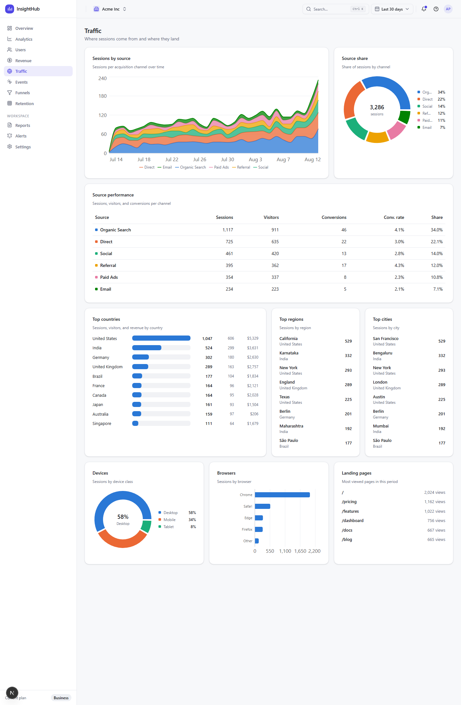
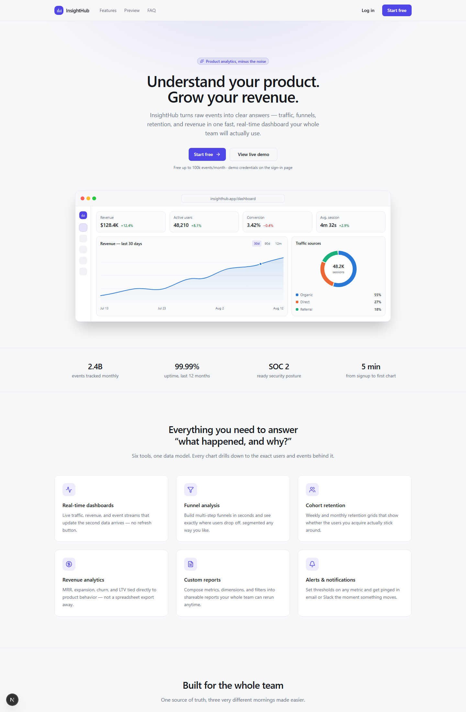

# InsightHub

A production-grade, multi-tenant SaaS analytics platform. Monitor traffic, revenue,
retention, funnels, and product events across workspaces — with role-based access,
saved reports, alerts, and a polished, fully responsive dashboard UI with first-class
dark mode.

> Built with Next.js (App Router) · TypeScript · Tailwind CSS v4 · shadcn/ui ·
> Recharts · Prisma · PostgreSQL · Auth.js (NextAuth v5) · Redis · Docker



<details>
<summary><b>More screenshots</b> — dark mode, revenue, funnels, retention, mobile…</summary>

| | |
|---|---|
|  |  |
|  |  |
|  |  |
|  |  |

</details>

## Features

- **Overview dashboard** — 6 KPI stat tiles with deltas & sparklines, revenue/session
  trend with daily/weekly/monthly aggregation, user growth (new vs returning vs
  active), traffic-source donut, geography, devices, browsers, top pages, and a live
  activity feed.
- **Report builder** — pick a metric × dimension × filters × visualization, run it
  against the warehouse, and save/schedule it for the team.
- **User analytics** — searchable, sortable, filterable user table with CSV export
  and per-user drill-down (sessions, events, revenue timeline).
- **Revenue analytics** — MRR / ARR / ARPU / refunds, revenue by product, country,
  and segment, plus a filterable transactions ledger.
- **Funnels** — configurable multi-step funnels with per-stage conversion and
  drop-off.
- **Retention** — weekly cohort heatmap.
- **Events** — define, monitor, and drill into product events.
- **Alerts** — threshold/percent-change alerts with in-app + email channels.
- **Workspaces & RBAC** — organizations with Owner / Admin / Analyst / Viewer roles
  enforced in the UI *and* the API layer.
- **Audit log** — every sensitive action recorded and browsable by admins.
- **Auth** — credentials sign-in, sign-up, forgot/reset password flows; OAuth-ready
  (GitHub/Google providers activate via env vars).
- **Ops-ready** — Docker + docker-compose, GitHub Actions CI, health endpoint,
  Redis caching with graceful in-memory fallback, rate limiting, security headers.

## Quick start (local)

Prerequisites: Node 20+ (22 recommended), Docker Desktop, npm.

```bash
git clone <this repo> insighthub && cd insighthub
cp .env.example .env          # defaults work with docker-compose
npm install

docker compose up -d postgres redis
npm run db:migrate            # applies prisma/migrations
npm run db:seed               # ~70k rows of realistic demo data (takes ~1 min)

npm run dev                   # http://localhost:3000
```

> **Port conflict?** If something already listens on 5432, add `POSTGRES_PORT=5433`
> to `.env` and change the port in `DATABASE_URL` to match.

### Demo credentials

All demo accounts use the password **`demo1234`** and share the “Acme Inc”
workspace (the owner also has a second workspace to demo switching):

| Email | Role |
|---|---|
| `owner@insighthub.demo` | Owner |
| `admin@insighthub.demo` | Admin |
| `analyst@insighthub.demo` | Analyst |
| `viewer@insighthub.demo` | Viewer |

Log in as different roles to see RBAC in action (viewers get read-only UI and
403s from mutating APIs).

## Scripts

| Command | What it does |
|---|---|
| `npm run dev` | Dev server |
| `npm run build` | `prisma generate` + production build |
| `npm start` | Serve the production build |
| `npm run lint` / `npm run typecheck` | ESLint / strict `tsc --noEmit` |
| `npm test` | Vitest unit tests |
| `npm run db:migrate` | Create/apply dev migrations |
| `npm run db:deploy` | Apply migrations (CI/production) |
| `npm run db:seed` | Seed demo data (idempotent — clears and reloads) |
| `npm run db:studio` | Prisma Studio |

## Project structure

```
prisma/                 schema, migrations, seed
src/
  app/                  App Router pages
    (auth)/             login, signup, forgot/reset password
    dashboard/          all product pages (+ per-route loading states)
    api/                REST-ish route handlers (zod-validated, RBAC-enforced)
  components/
    ui/                 shadcn/ui primitives
    charts/             TimeSeriesChart, CategoryBarChart, DonutChart, Sparkline
    dashboard/          KpiCard, ChartCard, EmptyState, ErrorState, Pagination…
    shell/              sidebar, topbar, date-range picker, search, notifications
  lib/
    analytics/          query services (overview, revenue, funnels, retention…)
    auth/               NextAuth config, RBAC, org context helpers
    validations/        zod schemas shared by client + server
    db/cache/redis/…    infrastructure helpers
tests/                  vitest unit tests
docs/                   architecture, database, API, deployment guides
```

## Environment variables

See [`.env.example`](./.env.example) for the full annotated list. Required:
`DATABASE_URL`, `AUTH_SECRET`, `AUTH_URL`. Optional integrations: `REDIS_URL`
(cache + rate limits), `SMTP_*` (emails; logged to console when unset),
`S3_*` (export storage), `AUTH_GITHUB_*` / `AUTH_GOOGLE_*` (OAuth).

## Documentation

- [Architecture](./docs/ARCHITECTURE.md) — system design, request flow, caching
- [Database](./docs/DATABASE.md) — ER model, indexing strategy
- [API](./docs/API.md) — endpoints, auth, error contract
- [Deployment](./docs/DEPLOYMENT.md) — Docker, cloud, CI/CD
- [Conventions](./docs/CONVENTIONS.md) — engineering standards used throughout

## Testing

```bash
npm test            # unit: RBAC matrix, date-range math, formatting, CSV, zod schemas
npm run typecheck   # strict TS across app + API
```

CI (GitHub Actions) runs lint, typecheck, tests, a production build against a real
Postgres service, and a Docker image build on `main`.

## License

MIT — use it as a starter, a reference, or a portfolio piece.
